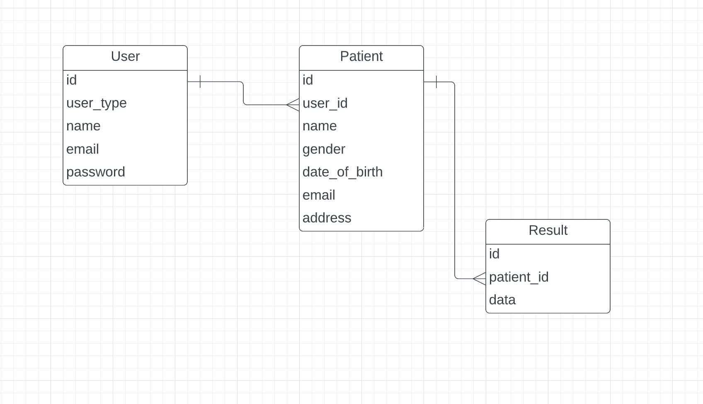

# Project Plan

### Project Information

For this application we have decided to use the PHP framework Laravel PHP in combination with Javascript framework VueJS by using the InertiaJS package.

InertiaJS is a package that combines the power of Laravel with the simplicity of VueJS.
It allows you to build your entire frontend using VueJS components, 
while still using Laravel's powerful routing and backend features.

### Data structuur

The data structure of the application is shown in the ERD below.

Persuasive has two types of users, scientists and GPs.

While Scientists can add new research belonging to a patient,
GPs can add new patients and view data belonging to a patient.

